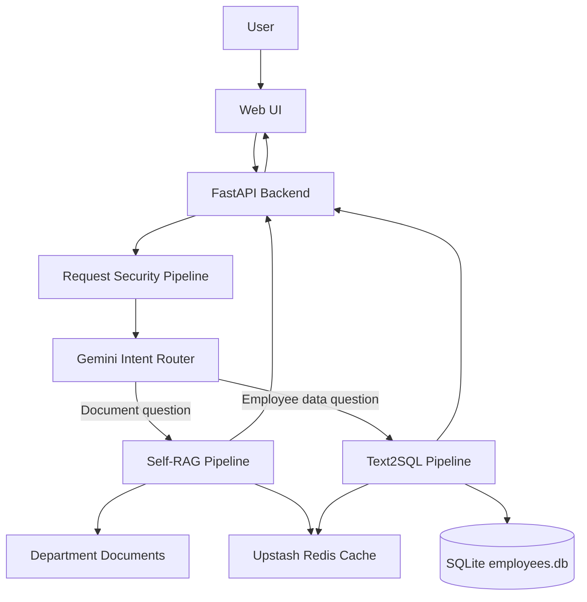
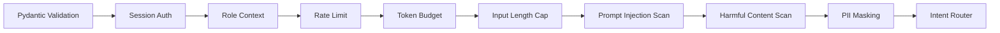
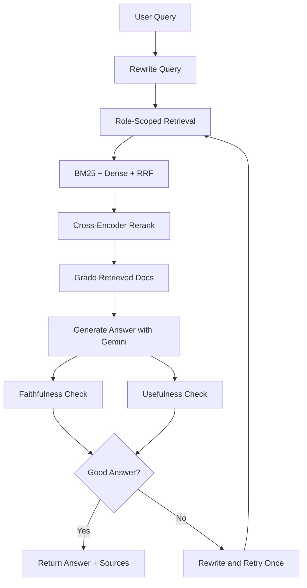
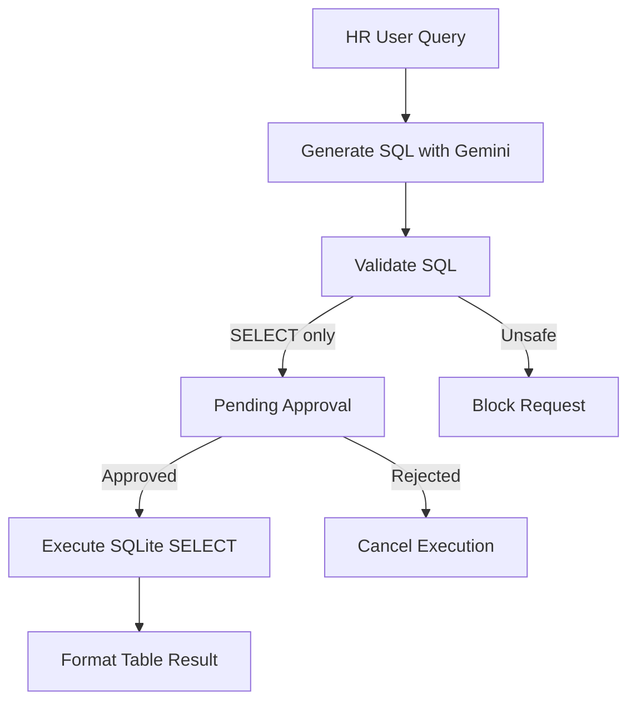
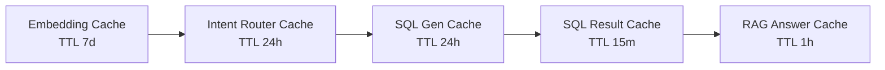

# FinSolve Internal Assistant

Role-aware enterprise chatbot for FinSolve Technologies. The system supports secure document Q&A, HR-only Text2SQL over employee data, Self-RAG validation, Redis-backed caching, and request-side guardrails.

## Features

- **Role-based access control**
  - `general`: general documents
  - `engineering`: engineering + general documents
  - `finance`: finance + general documents
  - `marketing`: marketing + general documents
  - `hr`: all documents + SQL access

- **Document Q&A with Self-RAG**
  - Query rewriting
  - Role-scoped retrieval
  - BM25 keyword retrieval
  - Chroma dense retrieval when available
  - RRF result fusion
  - Cross-encoder reranking
  - Document usefulness grading
  - Answer faithfulness check
  - Answer usefulness check
  - One retry with rewritten query when answer quality is weak

- **HR Text2SQL pipeline**
  - Gemini-based SQL generation
  - SQLite schema-aware prompting
  - SELECT-only validation
  - SQL blocklist enforcement
  - Human approval before execution
  - SQL result formatting
  - Follow-up SQL context memory

- **Request-side security pipeline**
  - Pydantic request validation
  - Session authentication
  - Role context enforcement
  - Per-user rate limit
  - Daily token budget
  - Input length cap
  - Prompt-injection scan
  - Harmful-content scan
  - PII masking before LLM calls

- **Output safety**
  - Role-aware PII redaction
  - Blocked-topic handling
  - Cross-department confidential data protection

- **Upstash Redis cache**
  - SHA-256 exact-match cache keys
  - Logical 5-tier cache:
    - Embedding cache: 7 days
    - Intent router cache: 24 hours
    - SQL generation cache: 24 hours
    - SQL result cache: 15 minutes
    - RAG answer cache: 1 hour

- **Web application**
  - Login screen
  - Role display
  - Chat UI
  - SQL approval cards
  - SQL result tables
  - Source display
  - Formatted assistant responses

- **Operational endpoints**
  - `/health`
  - `/metrics`


## Feature Overview

| Module                                  | Features Included                                                                                                                                                                                                                                                                                                                                                                                                                          |
| --------------------------------------- | ------------------------------------------------------------------------------------------------------------------------------------------------------------------------------------------------------------------------------------------------------------------------------------------------------------------------------------------------------------------------------------------------------------------------------------------ |
| **Role-Based Access Control**           | Supports five user roles: `general`, `engineering`, `finance`, `marketing`, and `hr`. Each role can access only its authorized documents. General users access general documents only; engineering users access engineering + general documents; finance users access finance + general documents; marketing users access marketing + general documents; HR users access all documents and SQL access.                                     |
| **Hybrid RAG Document Q&A**             | Provides secure document-based question answering using role-scoped retrieval, BM25 keyword retrieval, Chroma dense vector retrieval, SentenceTransformers `all-MiniLM-L6-v2` embeddings, Reciprocal Rank Fusion, cross-encoder reranking with `cross-encoder/ms-marco-MiniLM-L-6-v2`, source-grounded answer generation, and source display in the UI.                                                                                    |
| **Query Processing**                    | Uses query rewriting to improve vague or incomplete user questions before retrieval. Includes a Gemini-based intent router that decides whether a user query should go to the document Q&A pipeline or the HR employee-data Text2SQL pipeline.                                                                                                                                                                                             |
| **Self-RAG Validation**                 | Improves answer reliability through retrieved document usefulness grading, answer faithfulness checking, answer usefulness checking, hallucination reduction, and one retry with a rewritten query when the answer quality is weak.                                                                                                                                                                                                        |
| **HR Text2SQL Pipeline**                | Allows only HR users to ask employee-data questions. Includes Gemini-based SQL generation, SQLite schema-aware prompting, SELECT-only validation, SQL blocklist enforcement, human approval before execution, SQL approval cards in the UI, safe SQLite SELECT execution, SQL result formatting, and follow-up SQL context memory.                                                                                                         |
| **Request-Side Security Pipeline**      | Protects every request using Pydantic request validation, session authentication, role context enforcement, per-user rate limiting, daily token budget control, input length cap, prompt-injection scanning, harmful-content scanning, and PII masking before LLM calls.                                                                                                                                                                   |
| **Output Safety**                       | Applies role-aware PII redaction, blocked-topic handling, and cross-department confidential data protection so users cannot receive sensitive information outside their authorized role.                                                                                                                                                                                                                                                   |
| **Upstash Redis Cache**                 | Uses optional Upstash Redis caching to improve speed and reduce repeated computation. Includes SHA-256 exact-match cache keys and five logical cache layers: embedding cache with 7-day TTL, intent router cache with 24-hour TTL, SQL generation cache with 24-hour TTL, SQL result cache with 15-minute TTL, and RAG answer cache with 1-hour TTL. If Upstash credentials are missing, the application still runs without Redis caching. |
| **Web Application**                     | Includes a login screen, role display, chat UI, SQL approval cards, SQL result tables, document source display, and formatted assistant responses using HTML, CSS, JavaScript, and Jinja2 templates.                                                                                                                                                                                                                                       |
| **Backend API**                         | Built with FastAPI and includes routes for web UI, login, logout, chat, SQL approval, health check, and metrics. Handles authentication, request flow, routing, RAG execution, SQL approval workflow, and response delivery.                                                                                                                                                                                                               |
| **Data Storage**                        | Uses department documents for role-scoped RAG, ChromaDB for vector storage, SQLite `employees.db` for employee data, and local resource files for document and HR CSV data.                                                                                                                                                                                                                                                                |
| **Monitoring and Operations**           | Provides `/health` for application health checks and `/metrics` for Prometheus-compatible monitoring using Prometheus FastAPI Instrumentator.                                                                                                                                                                                                                                                                                              |
| **LLM Integration**                     | Uses Gemini through `langchain-google-genai` for intent routing, document answer generation, SQL generation, query rewriting, and Self-RAG validation checks.                                                                                                                                                                                                                                                                              |
| **Local Development and Configuration** | Supports `.env` configuration for `GEMINI_API_KEY`, `UPSTASH_REDIS_REST_URL`, and `UPSTASH_REDIS_REST_TOKEN`. Includes local setup with dependency installation, Chroma ingestion through `embed.py`, and FastAPI serving with Uvicorn.                                                                                                                                                                                                    |


## Architecture



## Request Security Pipeline



## Self-RAG Pipeline



## Text2SQL Pipeline



## Redis Cache Layers



## Tech Stack

| Area | Technology |
|---|---|
| Backend | FastAPI |
| UI | HTML, CSS, JavaScript, Jinja2 |
| LLM | Gemini via `langchain-google-genai` |
| RAG | LangChain, BM25, ChromaDB, RRF |
| Embeddings | SentenceTransformers `all-MiniLM-L6-v2` |
| Reranking | `cross-encoder/ms-marco-MiniLM-L-6-v2` |
| SQL Store | SQLite |
| Cache | Upstash Redis |
| Metrics | Prometheus FastAPI Instrumentator |

## Project Structure

```text
backend/
  main.py                  FastAPI routes and request flow
  services/
    auth.py                Static user authentication
    cache.py               Upstash Redis cache helpers
    rag.py                 Retrieval, Self-RAG, guardrails
    security.py            Request-side security pipeline
    sql.py                 SQLite initialization and execution
    sql_pipeline.py        Text2SQL generation, validation, approval
resources/data/            Department documents and HR CSV data
templates/index.html       Web UI
embed.py                   Chroma ingestion script
retriever.py               Vector store and user definitions
requirements.txt           Python dependencies
```

## Environment

Create `.env` in the project root:

```env
GEMINI_API_KEY=your_gemini_api_key
UPSTASH_REDIS_REST_URL=your_upstash_rest_url
UPSTASH_REDIS_REST_TOKEN=your_upstash_rest_token
```

Upstash variables are optional. If they are missing, the application runs without Redis caching.

## Local Run

```powershell
cd "d:\Finsolve-\Modified Finsole\Finsolve-"
.\.venv\Scripts\python.exe -m pip install -r requirements.txt
.\.venv\Scripts\python.exe embed.py
.\.venv\Scripts\python.exe -m uvicorn backend.main:app --host 127.0.0.1 --port 8000
```

Open:

```text
http://127.0.0.1:8000
```

## Demo Users

| Username | Password | Role |
|---|---|---|
| alice | hr123 | hr |
| bob | eng123 | engineering |
| carol | fin123 | finance |
| admin | admin123 | general |

## API Endpoints

| Method | Endpoint | Description |
|---|---|---|
| GET | `/` | Web UI |
| POST | `/login` | Login and receive session token |
| POST | `/logout` | Invalidate session |
| POST | `/chat` | Submit a user query |
| POST | `/sql/approve` | Approve or reject pending SQL |
| GET | `/health` | Health check |
| GET | `/metrics` | Prometheus metrics |

## Security Notes

- SQL execution is restricted to HR users.
- SQL mutation requests are blocked before generation and before execution.
- Only validated `SELECT` statements can reach the approval stage.
- Prompt-injection and harmful-content patterns are blocked before routing.
- PII is masked before LLM calls and scrubbed from output based on role.
- Redis cache keys use SHA-256 exact-match hashing.

## License

MIT
